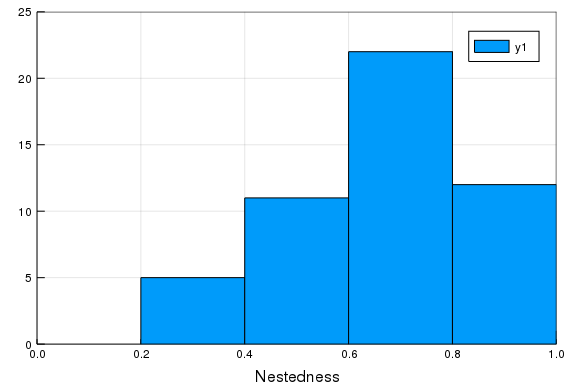

# Integration with `EcologicalNetworks.jl`

The **Mangal** package is integrated with **EcologicalNetworks** for analysis.

````julia
using Mangal
using EcologicalNetworks
````


## A simple example

In this simple example, we will look at a food web from 1956, retrieve it from
the Mangal database, then convert it into a usable object:

````julia
db_version = network("johnston_1956_19560101_947");
db_version.description
````


````
"Predation by short-eared owls on a salicornia salt marsh"
````


The conversion to the network is done using the `convert` method, which by
default will return a `UnipartiteNetwork`, where species are the `MangalNode` of
the original network:

````julia
N = convert(UnipartiteNetwork, db_version)
````


````
19×19 unipartite  ecological network (Bool, MangalNode) (L: 58)
````


We can check that the type of the network is correct:

````julia
eltype(N)
````


````
(Bool, MangalNode)
````


We can also confirm that all interactions and node counts match:

````julia
count(MangalInteraction, db_version) == links(N)
````


````
true
````


````julia
count(MangalNode, db_version) == richness(N)
````


````
true
````


## A more complex example

In this

````julia
hp_dataset = dataset("hadfield_2014");
hp_networks = networks(hp_dataset);
````


The next step might take a minute or two, but will consist in downloading every
information related to the network, and converting it into one
`UnipartiteNetwork` for every network in the dataset.

````julia
N = [convert(UnipartiteNetwork, n) for n in hp_networks];
````


Note that the previous step could use queries too, so it would be possible to
restrict the interactions to, *e.g.* a certain type, for networks with multiple
interaction types.

````julia
B = [convert(BipartiteNetwork, n) for n in N];
````


````julia
using Plots
histogram(η.(B), frame=:box, c=:white)
xaxis!("Nestedness", (0,1))
yaxis!("", (0, 25))
````





## Building custom networks

Converting to a network is *always* a wrapper around converting an array of
interactions. Let's imagine that we are interested in representing the network
of species that either consume, or are consumed by, salmonids. The first step
will be to retrieve the `MangalReferenceTaxon` that correspond to these species:

````julia
salmonids = backbones("q" => "Salmo")
````


````
5-element Array{MangalReferenceTaxon,1}:
 MangalReferenceTaxon(4173, "Salmo trutta", 47318, 161997, 8032, 10237843, 
missing, 2019-02-22T22:40:06, 2019-02-22T22:40:06)      
 MangalReferenceTaxon(4261, "Salmo gairdneri", missing, 161991, 857570, mis
sing, missing, 2019-02-22T22:40:12, 2019-02-22T22:40:12)
 MangalReferenceTaxon(4286, "Salmoninae", 71162, 623286, 504568, missing, m
issing, 2019-02-23T03:04:02, 2019-02-23T03:04:02)       
 MangalReferenceTaxon(5300, "Salmonidae", 1340, 161931, 8015, 11144860, mis
sing, 2019-02-27T04:10:07, 2019-02-27T04:10:07)         
 MangalReferenceTaxon(7015, "Salmo salar", 30453, 161996, 8030, 11144931, m
issing, 2019-03-19T19:16:54, 2019-03-19T19:16:54)
````


For every `MangalReferenceTaxon`, we need to retrieve its number of `MangalNode`
-- let's see how many there are, using the shorthand `count` method for this:

````julia
count.(MangalNode, salmonids)
````


````
5-element Array{Int64,1}:
 12
  1
  1
  5
  1
````


Since none of these are very high, we can retrieve the nodes directly:


````julia
salmonids_nodes = vcat(nodes.(salmonids)...);
````


At this point, we may want to count the number of interactions for all of the
nodes, but let us (for the sake of simplicity) trust that there are fewer than
500 in all cases:

````julia
all_int = [Mangal.interactions(salmo, "count" => 500) for salmo in salmonids_nodes];
salmonids_interactions = vcat(all_int...);
````


At this point, we end up with a `Vector{MangalInteraction}`, *i.e.* an array of
interactions.

An interesting consequence of this approach is that we now can look at all the
datasets that are part of this query, and *e.g.* retrieve their DOI:

````julia
salmonids_datasets = unique([i.network.dataset for i in salmonids_interactions])
[d.reference.doi for d in salmonids_datasets]
````


````
9-element Array{Union{Missing, String},1}:
 missing                          
 "10.1126/science.257.5073.1107"  
 "10.2307/1604"                   
 missing                          
 "10.1080/00288330.2004.9517265"  
 "10.1016/j.ecolmodel.2010.10.024"
 missing                          
 "10.1016/j.pocean.2012.02.002"   
 "10.2307/1599"
````


Finally, the array of interactions can be converted into a `UnipartiteNetwork`:

````julia
salmonid_network = convert(UnipartiteNetwork, salmonids_interactions)
````


````
408×408 unipartite  ecological network (Bool, MangalNode) (L: 406)
````


Get the taxa

````julia
salmonid_resolved_network = taxonize(salmonid_network)
````


````
59×59 unipartite  ecological network (Bool, MangalReferenceTaxon) (L: 57)
````


show interactions

````julia
for i in salmonid_resolved_network
  println("$(i.from.name) -> $(i.to.name)")
end
````


````
Salmo gairdneri -> Salvelinus fontinalis
Salmo gairdneri -> Semotilus atromaculatus
Salmo gairdneri -> Catostomus commersoni
Salmo gairdneri -> Rhinichthys atratulus
Salmo trutta -> Diporeia
Salmo trutta -> Benthos
Salmo trutta -> Mysis
Salmonidae -> Osmeridae
Salmo trutta -> Alosa pseudoharengus
Salmo trutta -> Cottoidea
Salvelinus fontinalis -> Salmo gairdneri
Salmo gairdneri -> Salmo gairdneri
Salmo gairdneri -> Semotilus corporalis
Salmo gairdneri -> Notropis cornutus
Salmoninae -> Mugilidae
Salmonidae -> Salmonidae
Oncorhynchus kisutch -> Salmonidae
Sebastes -> Salmonidae
Cephalopoda -> Salmonidae
Oncorhynchus tshawytscha -> Salmonidae
Selachimorpha -> Salmonidae
Trachurus symmetricus -> Salmonidae
Squalus -> Salmonidae
Phycidae -> Salmonidae
Anoplopoma fimbria -> Salmonidae
Flatfish -> Salmonidae
Ardenna grisea -> Salmonidae
Uria aalge -> Salmonidae
Laridae -> Salmonidae
Alcidae -> Salmonidae
Aves -> Salmonidae
Phocidae -> Salmonidae
Procellariiformes -> Salmonidae
Mysticeti -> Salmonidae
Odontoceti -> Salmonidae
Hexagrammidae -> Salmonidae
Metacarcinus magister -> Salmonidae
Salmonidae -> Copepods
Salmonidae -> Amphipoda
Salmonidae -> Medusozoa
Salmonidae -> Pacifica
Salmonidae -> Spinifera
Salmonidae -> Clupeidae
Salmonidae -> Engraulidae
Salmonidae -> Mysida
Salmonidae -> Isopoda
Salmo salar -> Baetis
Salmo salar -> Chironomidae
Salmo salar -> Leuctra
Salmo salar -> Diatoms
Salmo salar -> Desmidiales
Salmo salar -> Algae
Salmo salar -> Ephemeroptera
Salmo salar -> Chimarra marginata
Salmo salar -> Protozoa
Salmo salar -> Micronecta poweri
Salmo salar -> Collembola
````


